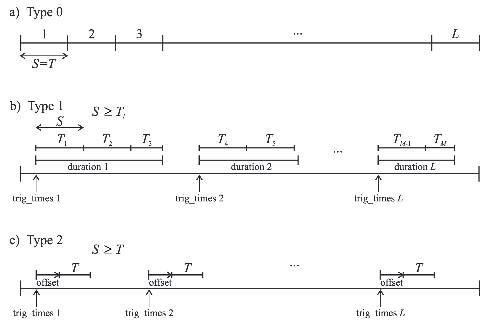

# NeuroSpec

NeuroSpec consists of a number of MATLAB functions for performing 
multivariate Fourier analysis of time series and/or point process (spike 
train or event) data, and plotting the results. 
The framework was designed primarily for use on neural data, but is suited 
to a wide range of stationary stochastic (random) signals. 

**Table of contents**

- [Getting started](#getting-started)
- [Library](#library)
    - [Spectral analysis](#spectral-analysis)
    - [Comparison of spectra](#comparison-of-spectra)
    - [Comparison of coherence](#comparison-of-coherence)
    - [Pooled spectra or coherence](#pooled-spectra-or-coherence)
    - [Directionality analysis](#directionality-analysis)
    - [Spectral tracking](#spectral-tracking)
    - [Plots](#plots)
- [Acknowledgements](#acknowledgements)
- [Cite](#cite)
- [Contact](#contact)

## Getting started

*Spectral analysis:*

[`sp2_type0_demo1`](docs/demos/spectral-analysis/sp2_type0_demo1.m): Type 0 spectral analysis.

[`sp2_type1_demo1`](docs/demos/spectral-analysis/sp2_type1_demo1.m): Type 1 spectral analysis.

[`sp2_type2_demo1`](docs/demos/spectral-analysis/sp2_type2_demo1.m): Type 2 spectral analysis.

[`sp2_comp_demo1`](docs/demos/spectral-analysis/sp2_comp_demo1.m): comparing spectra and comparing coherence.

[`sp2_pool_demo1`](docs/demos/spectral-analysis/sp2_pool_demo1.m): pooled spectral and coherence analysis using 10 bivariate datasets.

*Directionality analysis:*

[`R2_cn_demo1`](docs/demos/directionality-analysis/R2_cn_demo1.m): two 
channel non-parametric unconditional directionality analysis using 
simulated cortical neuron data.

[`R2_ts_demo1`](docs/demos/directionality-analysis/R2_ts_demo1.m): 
unconditional directionality analysis applied to time series data with various
types of interaction.

[`R2_AR4_demo1`](docs/demos/directionality-analysis/R2_AR4_demo1.m): 
unconditional directionality analysis applied to time series data generated
using a bivariate AR(4) model with coupling in only the forward direction.

[`R2_pc_table1_demo`](docs/demos/directionality-analysis/R2_pc_table1_demo.m): 
three channel, conditional analysis as presented by Halliday et al., 2016 in 
Tables 1 and 2 (i.e., 
[`table1`](docs/demos/directionality-analysis/R2_pc_table1_demo.m) and 
[`table2`](docs/demos/directionality-analysis/R2_pc_table2_demo.m)).

[`R2_cn_pc_demo1`](docs/demos/directionality-analysis/R2_cn_pc_demo1.m): 
conditional directionality analysis on three spike train signals using 
simulated cortical neuron data.

[`R2_ts_pc_demo1`](docs/demos/directionality-analysis/R2_ts_pc_demo1.m):
conditional directionality analysis on time series consisting of known
interactions between mixtures of Gaussian signals, with two outputs and two 
shared common inputs.

*Spectral tracking:*

[`ztrack_demo1`](docs/demos/spectral-tracking/ztrack_demo1.m): spectral tracking applied on
2 channel Gaussian data containing a linear increase-decrease pattern of coherence,
with modulation of coherence constant across all frequencies.

[`ztrack_demo2`](docs/demos/spectral-tracking/ztrack_demo2.m): demonstration of the effects of varying
parameters of the spectral tracking algorithm.

[`ztrack_ramp_demo1`](docs/demos/spectral-tracking/ztrack_ramp_demo1.m):
demonstration of the tracking algorithm using a extensive simulation study.

## Library

### Spectral analysis

Two channel weighted periodogram analysis:

- Frequency domain `f`
- Time domain `t`
- Confidence limits and other analysis parameters `cl`
- Spectral coefficients `sc`

 

[`sp2a2_m1`](neurospec/sp2a2_m1.m): processing two time series.

<code>
&emsp;  [f,t,cl,sc] =  sp2a2_m1(0,dat1,dat2,samp_rate,seg_pwr,opt_str)
</code> 

<code>
&emsp; [f,t,cl,sc] =  sp2a2_m1(1,dat1,dat2,trig_times,duration,samp_rate,seg_pwr,opt_str)
</code> 

<code>
&emsp; [f,t,cl,sc] =  sp2a2_m1(2,dat1,dat2,trig_times,offset,seg_pts,samp_rate,seg_pwr,opt_str)
</code> 

&nbsp;

[`sp2a_m1`](neurospec/sp2a_m1.m): processing hybrid data.

<code>
&emsp; [f,t,cl,sc] =  sp2a_m1(0,sp1,dat2,samp_rate,seg_pwr,opt_str)
</code> 

<code>
&emsp; [f,t,cl,sc] =  sp2a_m1(1,sp1,dat2,trig_times,duration,samp_rate,seg_pwr,opt_str)
</code> 

<code>
&emsp; [f,t,cl,sc] =  sp2a_m1(2,sp1,dat2,trig_times,offset,seg_pts,samp_rate,seg_pwr,opt_str)
</code> 

&nbsp;

[`sp2_m1`](neurospec/sp2_m1.m): processing two spike trains.

<code>
&emsp; [f,t,cl,sc] =  sp2_m1(0,sp1,sp2,sec_tot,samp_rate,seg_pwr,opt_str)
</code> 

<code>
&emsp; [f,t,cl,sc] =  sp2_m1(1,sp1,sp2,trig_times,duration,sec_tot,samp_rate,seg_pwr,opt_str)
</code> 

<code>
&emsp; [f,t,cl,sc] =  sp2_m1(2,sp1,sp2,trig_times,offset,seg_pts,sec_tot,samp_rate,seg_pwr,opt_str)
</code> 

&nbsp;

Each of these routines supports three distinct types of data analysis, 
referred to as 
Type 0 (single unbroken stretch of data), 
Type 1 (multiple sections from a single record with multiple segments each), and 
Type 2 (multiple sections from a single record with a unique segment each):

### Comparison of spectra

[`sp2_compf`](neurospec/sp2_compf.m): assess statistically significant differences between two spectral estimates.

The two spectral estimates should be derived independently, i.e., they 
should be calculated from data sampled at different times.

### Comparison of coherence

[`sp2_compcoh`](neurospec/sp2_compcoh.m): compare two coherence estimates derived from the same number of segments.

The coherence estimates must be independent, i.e., they should be calculated
from bivariate data sampled at different times.

### Pooled spectra or coherence

[`pool_scf`](neurospec/pool_scf): create or update the pooled parameter estimates.

[`pool_sfc`](neurospec/pool_sfc): check input.

[`pool_scf_out`](neurospec/pool_scf_out): transform output.

A key assumption in calculating pooled spectra and coherence is that the datasets
to be pooled are independent.

Pooling can be done on Type 0, Type 1 or single offset Type 2 spectral analysis. 
Pooling over a range of offset values in Type 2 analysis should be done separately 
at each offset. 

### Directionality analysis

[`sp2a2_R2`](neurospec/sp2a2_R2.m): bivariate (unconditional) directionality analysis
([`_mt`](neurospec/sp2a2_R2_mt.m) with additional options).

[`sp2a2_R2_pc1`](neurospec/sp2a2_R2_pc1.m): unconditional directionality analysis 
between the signals $x$ and $y$ conditioned on a third signal $z$.

[`R2_f1`](neurospec/R2_f1.m): calculate directionality metrics over a reduced frequency range.

These routines support Type 0 data analysis. Data segmentation strategies referred to
as Type 1 and Type 2 analysis are not supported.

### Spectral tracking

[`sp2a2_zt`](neurospec/sp2a2_zt): time varying coherence estimates as described 
by Halliday et al. (2018).

These routines support Type 0 data analysis. Data segmentation strategies referred to
as Type 1 and Type 2 analysis are not supported.

### Plots

*Spectral analysis:*

[`psp_fa1`](neurospec/psp_fa1.m): log spectral estimate (`_fa1` for input, `_fb1` for output).

[`psp_fcova1`](neurospec/psp_fcova1.m): periodogram COV test for spectral estimate (`_fcova1` for input, `_fcovb1` for output).

[`psp_ch1`](neurospec/psp_ch1.m): coherence estimate (`_ch1cl` with point-wise confidence limits).

[`psp_ph1`](neurospec/psp_ph1.m): phase estimate (`_ph1cl` with point-wise confidence limits).

[`psp_q1`](neurospec/psp_q1.m): cumulant density estimate.

[`psp_g1`](neurospec/psp_g1.m): log gain estimate (`_g1cl` with point-wise confidence limits).

[`psp_a1`](neurospec/psp_a1.m): impulse response estimate.

[`psptf_fa1a`](neurospec/psptf_fa1a.m): time dependent log spectral estimate for Type 2 analysis (`_fa1a` for input, `_fb1a` for output; `_fa1` and `_fb1` deprecated files).

[`psptf_ch1a`](neurospec/psptf_ch1a.m): time dependent coherence estimate for Type 2 analysis (`_ch1` deprecated file).

[`psptf_ph1a`](neurospec/psptf_ph1a.m): time dependent phase estimate for Type 2 analysis (`_ph1` deprecated file).

[`psptf_q1a`](neurospec/psptf_q1a.m): time dependent cumulant density estimate for Type 2 analysis (`_q1` deprecated file).

[`psp2`](neurospec/psp2.m): main output plots fot Type 0, 1 or 2 (single offset) analysis including autospectra for each input signal, coherence, phase and cumulant density.

[`psp2s`](neurospec/psp2s.m): main plots, estimated gain and impulse response.

[`psp2_cov`](neurospec/psp2_cov.m): main plots and Periodogram COV test for weak stationarity for each channel.

[`psp2_tf`](neurospec/psp2_tf.m): main output plots for Type 2 analysis using a range of offset values.

 

*Comparison of spectra and comparison of coherence:*

[`psp_compf1`](neurospec/psp_compf1.m): comparison of spectra.

[`psp_compcoh1`](neurospec/psp_compcoh1.m): comparison of coherence.

 

*Pooled spectra and pooled coherence:*

[`psp_chia1`](neurospec/psp_chia1.m): $\chi^2$ difference of spectra test (`_chia1` for input, `_chib1` for output).

[`psp_chi1`](neurospec/psp_chi1.m): $\chi^2$ difference of coherence test.

[`psp_chplf1`](neurospec/psp_chplf1.m): alternative pooled coherence estimate.

[`psp_chst1`](neurospec/psp_chst1.m): histogram of significant coherence values in population.

[`psp2_pool6`](neurospec/psp2_pool6.m): 6 main plots.

[`psp2_pool8`](neurospec/psp2_pool8.m): 8 main plots.

[`psp2_pool8_chi3`](neurospec/psp2_pool8_chi3.m): including 3 chi-squared tests (no time domain).

[`psp2_pool9_chi3`](neurospec/psp2_pool9_chi3.m): including 3 chi-squared tests (with time domain).

 

*Directionality analysis:*

[`psp2_R2`](neurospec/psp2_R2.m): 7 main plots for directionality analysis, i.e.,
2 autospectra, 2 coherence, phase, cumulant density and the time domain directionality function.

 

*Spectral tracking:*

[`pspzt_ch1`](neurospec/pspzt_ch1.m): coherence over segments, 1 frequency or average over frequencies
([`_target`](neurospec/pspzt_ch1_target.m) to include target coherence for surrogate data).

[`pspzt_ch1_seg`](neurospec/pspzt_ch1_seg.m): coherence over 1 segment, over specificied frequency range.

[`pspzt_ch1_tf`](neurospec/pspzt_ch1_tf.m): heat map of coherence over all segments and specified frequency range.

 

Further information in user guides, source files, demos and references.

## Acknowledgements
**NeuroSpec** code written by David Halliday. The following people have all contributed to the development of the framework: Jay Rosenberg, Bernie Conway, Abdul Majeed Amjad, Alex Rigas, David Murray-Smith, Joe Lau, Peter Breeze, Simon Farmer, Jens Nielsen, Yang Zhan, John-Stuart Brittain, Carl Stevenson, Rob Mason.

Development of NeuroSpec was supported in part by grants from the UK Joint Research Council Cognitive Science/HCI Initiative, The Wellcome Trust (Grants 036928; 048128; 058615), the UK Engineering and Physical Sciences Research Council (GR/R12350/01), and the UK Biotechnology and Biological Sciences Research Council (10477).

## Cite

Please refer to the articles below (as appropriate) in any scholarly 
publications resulting from the use of NeuroSpec software.

#### Basic tutorial reviews

Rosenberg, J.R., Amjad, A.M., Breeze, P., Brillinger, D.R., & Halliday, 
D.M. (1989). The Fourier  approach to the identification of functional 
coupling between neuronal spike trains. Progress in Biophysics and 
molecular Biology 53, 1-31.
[DOI:10.1016/0079-6107(89)90004-7](http://dx.doi.org/10.1016/0079-6107(89)90004-7)

Halliday, D.M., Rosenberg, J.R., Amjad, A.M., Breeze, P., Conway, B.A. & 
Farmer, S.F. (1995).  A framework for the analysis of mixed time 
series/point process data - theory and application to the study of 
physiological tremor, single motor unit discharges and electromyograms. 
Progress in Biophysics and molecular Biology 64, 237-278.
[DOI:10.1016/S0079-6107(96)00009-0](http://dx.doi.org/10.1016/S0079-6107(96)00009-0)

#### Time frequency analysis

Zhan, Y., Halliday, D.M., Liu, X. & Feng, J. (2006) Detecting 
time-dependent coherence between  non-stationary electrophysiological 
signals - A combined statistical and time-frequency approach. Journal of 
Neuroscience Methods, 156, 322-332.

#### Comparison of spectra

Diggle, P.J. (1990) Time series. A biostatistical introduction. 
Clarendon Press, Oxford.

#### Comparison of coherence

Rosenberg, J.R., Amjad, A.M., Breeze, P., Brillinger, D.R., & Halliday, 
D.M. (1989). The Fourier  approach to the identification of functional 
coupling between neuronal spike trains. Progress in Biophysics and 
molecular Biology 53, 1-31.

#### Pooled spectra and coherence

Amjad, A.M., Halliday, D.M., Rosenberg, J.R. & Conway, B.A. (1997). An 
extended difference of  coherence test for comparing and combining several 
independent coherence estimates — theory and application to the study of 
motor units and physiological tremor. Journal of Neuroscience Methods 73, 
69-79.

Halliday, D.M. & Rosenberg, J.R. (2000). On the application, estimation and 
interpretation of  coherence and pooled coherence. Journal of Neuroscience 
Methods, 100, 173-174.

#### Non parametric directionality analysis for bivariate data

Halliday, D.M. (2015). Nonparametric directionality measures for time 
series and point process data,  Journal of Integrative Neuroscience, 14(2), 
253-277.
[DOI:10.1142/S0219635215300127](http://dx.doi.org/10.1142/S0219635215300127), Download: [Link](https://eprints.whiterose.ac.uk/120301/)

#### Conditional non parametric directional analysis

Halliday, D. M., Senik, M. H., Stevenson, C. W., & Mason, R. (2016). Non 
parametric directionality  analysis - extension for removal of a single 
common predictor and application to time series. Journal of Neuroscience 
Methods, 268, 87-97.
[DOI:10.1016/j.jneumeth.2016.05.008](http://dx.doi.org/10.1016/j.jneumeth.2016.05.008)

#### Spectral tracking

Halliday, D. M., Brittain, J.-S., Stevenson, C. W., & Mason, R. (2018). 
Adaptive spectral tracking  for coherence estimation: the z -tracker. 
Journal of Neural Engineering, 15(2), 26004.
[DOI:10.1088/1741-2552/aaa3b4](http://doi.org/10.1088/1741-2552/aaa3b4)

#### Additional material and discussions

Halliday, D.M. & Rosenberg, J.R. (1999). Time and frequency domain analysis 
of spike train and  time series data. In: Modern Techniques in Neuroscience 
Research, (Eds. U. Windhorst & H. Johansson), Springer-Verlag, Ch 18, 
503-543. 

Halliday, D.M. (2005) Spike train analysis for neural systems. In: 
Modelling in the Neurosciences  (2nd edition) (Eds: Reeke, G.N. et al.), 
CRC Press, 555-579.

Nielsen J.B., Conway B.A., Halliday D.M., Perreault M-C. & Hultborn H. (2005) 
Organization  of common synaptic drive to motoneurones during fictive 
locomotion in the spinal cat. Journal of Physiology, 569, 291-304.

### Contact
david.halliday@york.ac.uk
